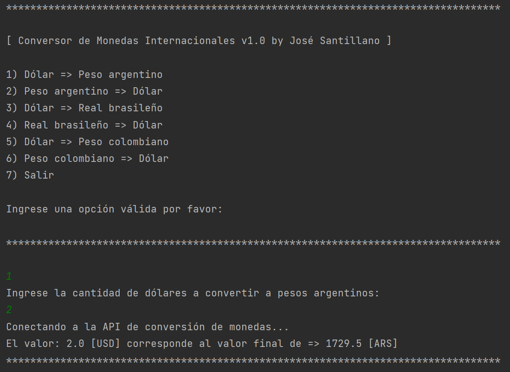

# Documentación del Challenge Conversor de Monedas Alura Latam v1.0.0
## Descripción del proyecto

Este proyecto es parte del Challenge de Alura Latam para poner a prueba las habilidades con Java y el consumo de las APIs. Este programa en consola realizará tareas de conversiones de ciertas monedas.

Ejemplo de la aplicación:

## Recursos
El proyecto esta creado con las siguientes tecnologías:

| Plugin           | URL                      |
|------------------|--------------------------|
| GSON             | https://search.maven.org/artifact/com.google.code.gson/gson/2.10.1/jar?eh= |
| ExchangeRate-API | https://www.exchangerate-api.com/docs/java-currency-api |

## Para más información

Documentación de la API: https://www.exchangerate-api.com/docs/java-currency-api
Documentación de la API y Divisas: https://www.exchangerate-api.com/docs/supported-currencies
Documentación de GSON: https://search.maven.org/artifact/com.google.code.gson/gson/2.10.1/jar?eh=

